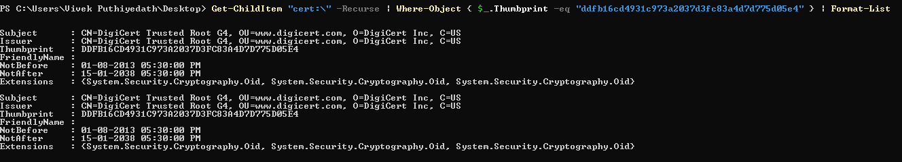

# What it does
Add the 'DigiCert Trusted Root G4' certificate to the Trusted Root Certification Authorities of the machine if it is not present.

# How to check the certificate is already present or not 

* Use the following command to check whether the certificate is available on the asset: 

        Get-ChildItem "cert:\" -Recurse | Where-Object { $_.Thumbprint -eq "ddfb16cd4931c973a2037d3fc83a4d7d775d05e4" } | Format-List

* If the certificate is not available, the output will be empty.
* If the certificate is available on the asset, the output will be similar to the output below.

  

# Step by step working
1. Check certificate is existing on the machine. If already installed, exit.
2. If the file is passed as a parameter, Install the cert and exit. Else follow further steps
3. Try to download the file from the DigiCert website and add it. If this succeeds add the cert file to the root store. 
4. If nothing works, the script will ask the user to manually download it and pass the file as a parameter.

# How to use the script
Please check the script help to see the examples. To get the help, run

    Get-Help .\DigiCertUpdate.ps1 -Full

# Examples
* To update it from the internet 

        PS C:\> .\DigiCertUpdate.ps1

* To update it from a file path

        PS C:\> .\DigiCertUpdate.ps1 -CertPath <Cert File Path>

* Usage with proxy

        PS C:\> .\DigiCertUpdate.ps1 -ProxyAddress "10.10.10.10" -ProxyPort 3128 

* Proxy with credentials

        PS C:\> .\DigiCertUpdate.ps1 -ProxyAddress "10.10.10.10" -ProxyPort 3128 -ProxyUser "admin" -ProxyPassword "abc123"

# Note
* If you are using this script with Qualys Script Central/CAR, set the PowerShell execution policy to unrestricted becuase the script is not signed.

        PS C:\> Set-ExecutionPolicy Unrestricted -Force

* To set the execution policy via group policy, check this link [Use Group Policy to Manage Execution Policy](https://docs.microsoft.com/en-us/powershell/module/microsoft.powershell.core/about/about_execution_policies?view=powershell-7.2#use-group-policy-to-manage-execution-policy).
* After running the script, do not forget to set the policy back to the default.

        PS C:\> Set-ExecutionPolicy Default -Force

# License
[License](/LICENSE.md)